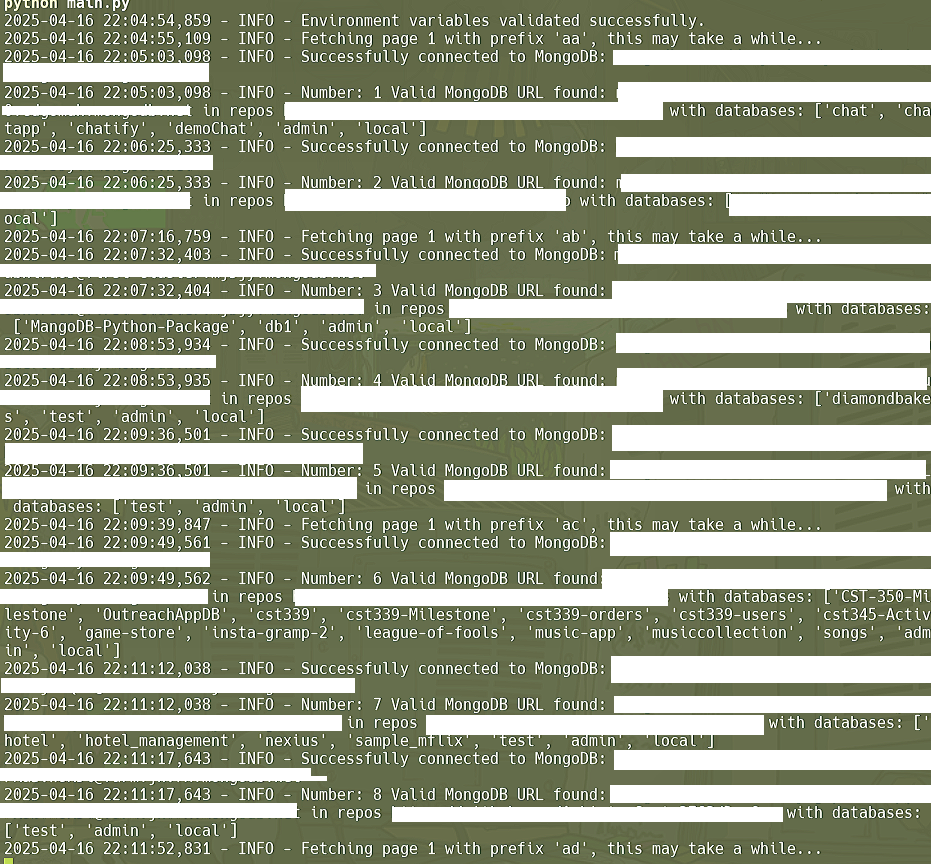

# GH-LeakSealer

GH-LeakSealer is a Python script designed to search for exposed MongoDB connection strings in public GitHub repositories. It identifies repositories containing MongoDB connection strings, tests their validity, and lists the databases accessible through these connections. The script can optionally raise an issue on the affected repository, but this feature is considered spammy and is disabled by default.

> [!CAUTION]
> At first I was posting issues in the corresponding repository and I had a lot of great feedback from the community helping raise security awareness but can be considered as spam by the github team.



## Features

- Searches for MongoDB connection strings (`mongodb+srv://`) in public GitHub repositories.
- Tests the validity of the connection strings and lists accessible databases.
- Logs information about vulnerable repositories.
- Optionally raises an issue on the affected repository (disabled by default to avoid spamming).

## Prerequisites

Before using this script, ensure you have the following:

1. Python 3.8 or higher installed.
2. A MongoDB instance to test the connection.
3. A GitHub personal access token with the necessary permissions.

## Setup

1. Clone this repository:

   ```bash
   git clone https://github.com/your-username/GH-LeakSealer.git
   cd GH-LeakSealer
   ```

2. Create a `.env` file in the root directory with the following variables:

   ```env
   GH_API_TOKEN=<your_github_personal_access_token>
   mongo_url=<your_mongodb_connection_string>
   burp0_cookies=<your_burp_suite_cookies_as_json>
   burp0_headers_issue=<your_burp_suite_headers_as_json>
   ```

   - `GH_API_TOKEN`: Your GitHub personal access token.
   - `mongo_url`: A MongoDB connection string for testing purposes.
   - `burp0_cookies` and `burp0_headers_issue`: Optional, used to push issues. Can get them in localStorage or using BurpSuite.

3. Add the `./.env` file to your `.gitignore` to prevent accidental exposure:

   ```bash
   echo "**/.env" >> .gitignore
   ```
4. Install the requirements
     ```bash
   pip install -r requirements.txt
   ```
## Usage

1. Run the script to search for exposed MongoDB connection strings:

   ```bash
   python main.py
   ```

2. The script will:

   - Search GitHub for repositories containing MongoDB connection strings.
   - Test the validity of the connection strings and list accessible databases.
   - Log information about vulnerable repositories.

3. **Note**: The feature to raise issues on affected repositories is disabled by default to avoid spamming. If you wish to enable it, you can use the push_issue_to_gh function in the [push_issue.py](./push_issue.py) file

## Example Output

```
INFO: Successfully connected to MongoDB: mongodb+srv://example.mongodb.net/
INFO: Found exposed MongoDB cluster in repository: https://github.com/example/repo
INFO: Accessible databases: ['admin', 'local', 'test']
```

## Troubleshooting

- **Error: `GH_API_TOKEN is not set in the .env file`**
  Ensure you have created a `.env` file with the correct `GH_API_TOKEN`.

- **Error: `Invalid MongoDB URI`**
  Check that your MongoDB connection string is correctly formatted.

## Disclaimer

This script is intended for educational and ethical purposes only. Do not use it to exploit or harm others.

## Contributing

Contributions are welcome! Feel free to open an issue or submit a pull request.

## License

This project is licensed under the MIT License. See the `LICENSE` file for details.